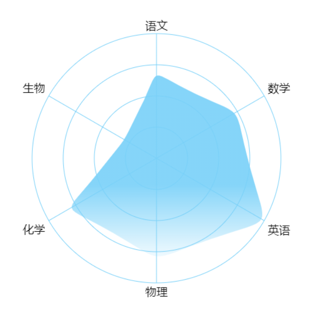

# radar-canvas

_原生 canvas 渲染的雷达图，具有基本的功能配置_

## 目录

- [安装](#安装)
- [示例](#示例)
- [配置参数](#配置参数)

## 安装

npm:

```sh
 npm install radar-canvas
```

CDN:

```html
<script src="./../dist/index.js"></script>
```

## 示例

> 克隆这个仓库，用浏览器打开 example 目录下 index.html 文件查看效果

<div style="margin-bottom: 5px">
  
  
</div>

```javascript
const cw = 500;
const ch = 500;
const radius = 200;
const canvas_node = document.getElementById("radar");
canvas_node.width = cw;
canvas_node.height = ch;

const ctx = canvas_node.getContext("2d");

const radar = new Radar({
  ctx,
  /**
   * 雷达图半径
   **/
  radius,
  /**
   * 指示器轴的分割段数
   **/
  splitNumber: 4,
  /**
   * 雷达图的指示器，用来指定雷达图中的多个变量（维度）
   **/
  indicator: [
    { text: "语文", max: 150 },
    { text: "数学", max: 150 },
    { text: "英语", max: 150 },
    { text: "物理", max: 100 },
    { text: "化学", max: 100 },
    { text: "生物", max: 100 },
  ],
  /**
   * 雷达图的数据
   **/
  data: {
    /**
     * 其中的value项数组是具体的数据，每个值跟 indicator 一一对应。
     **/
    value: [100, 110, 150, 80, 80, 30],
    /**
     * 数据区域填充的颜色
     **/
    fill: [
      [0, "rgba(120, 208, 248, 0.1)"],
      [1, "rgba(120, 208, 248, 0.9)"],
    ],
    /**
     *  sharp 锐角 sharp 平滑的
     **/
    type: "smooth",
    // type: "sharp",
    /**
     * 绘制点
     **/
    symbol: {
      show: false,
      pointStyle: {
        size: 6,
        color: "#0182ff",
      },
    },
    /**
     * 控制bezier控制点的偏移，控制这个值可以控制圆角，只有在 type 为smooth时生效
     **/
    bezierOffset: 20,
    /**
     * 绘制边线
     **/
    line: {
      show: false,
      lineStyle: {
        color: "#56a3f1",
      },
    },
  },
  /**
   * 指示器轴的分割线的类型，polygon 多边形、circle 圆形
   **/
  shape: "circle",
  /**
   * 雷达图在canvas上渲染的坐标
   **/
  x: 50,
  y: 50,
  /**
   * 坐标系起始角度，也就是第一个指示器轴的角度。
   **/
  startAngle: 90,
  /**
   * 指示器轴线
   **/
  axisLine: {
    lineStyle: {
      color: "#78D0F8",
    },
  },
  /**
   * 指示器轴的分割线
   **/
  splitLine: {
    lineStyle: {
      color: "#78D0F8",
    },
  },
});

radar.render();
```

## 配置参数

_具体查看 [index.d.ts](dist/index.d.ts) 文件_

## License

MIT
